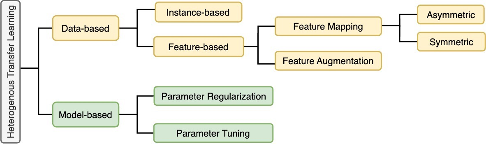
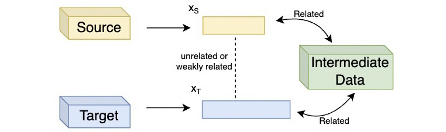
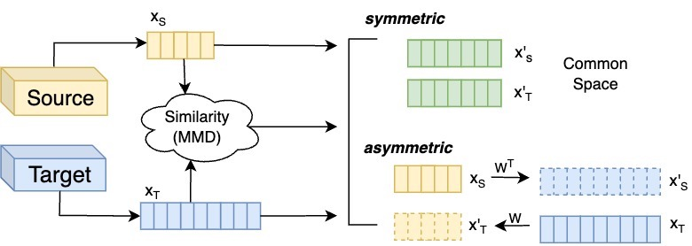
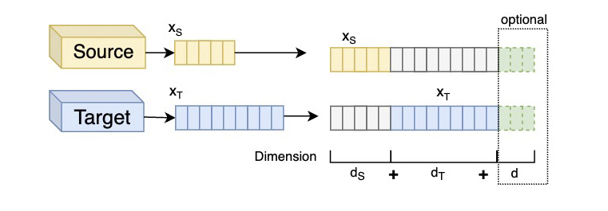
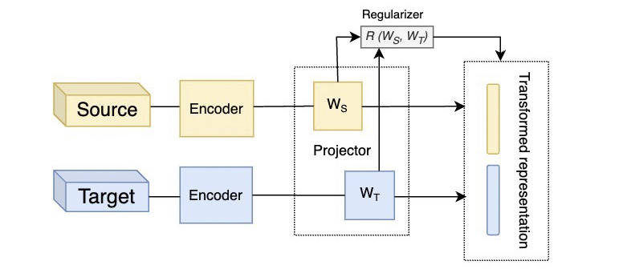
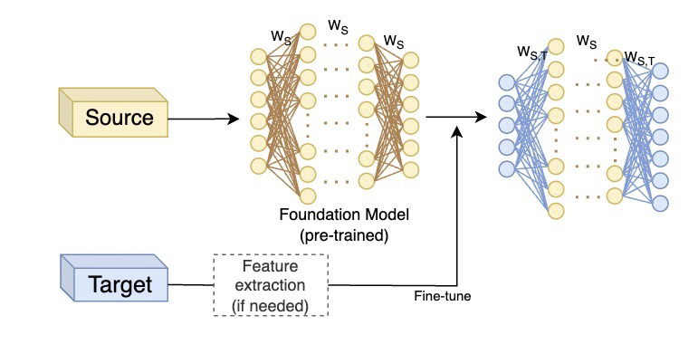
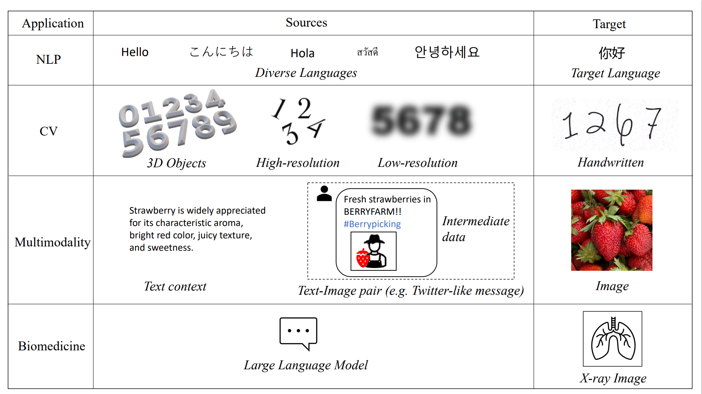

# Heterogeneous-Transfer-Learning
This is a comprehensive list of **Heterogeneous Transfer Learning Methods** with corresponding resources such as research papers, code, and datasets. Please feel free to contact us at YIS108@pitt.edu if you discover any errors or have any suggestions.

🌟 The organization of papers aligns with our survey: [**A survey of Heterogeneous Transfer Learning**](https://arxiv.org/abs/2310.08459). 



If you find this resource helpful, please consider to star this repository and cite our survey paper:

```
@article{bao2023survey,
  title={A Survey of Heterogeneous Transfer Learning}, 
  author={Runxue Bao and Yiming Sun and Yuhe Gao and Jindong Wang and Qiang Yang and Haifeng Chen and Zhi-Hong Mao and Ye Ye},
  journal={arXiv preprint arXiv:2310.08459},
  year={2023}
}
```

## Data-based Method

### Instance-based Method



1. <u>TTL</u>:**"Transitive transfer learning"**. Tan, Ben, et al. Proceedings of the 21th ACM SIGKDD International Conference on Knowledge Discovery and Data Mining. 2015.[[paper](https://dl.acm.org/doi/pdf/10.1145/2783258.2783295?casa_token=Snq_IwYJjmMAAAAA:EMWZUPNUna4Tlh6H7BKAT5qajvpTzc3jmx1AgXCH66tubdlJvscVzs-cgMyBEhEsBzQEQk2raeYF)]
2. <u>HTLIC</u>:**"Heterogeneous transfer learning for image classification."**. Zhu, Yin, et al. Proceedings of the AAAI conference on artificial intelligence. Vol. 25. No. 1. 2011. [[paper](https://ojs.aaai.org/index.php/AAAI/article/view/8090)]
3. <u>DHTL</u>:**"Deep semantic mapping for heterogeneous multimedia transfer learning using co-occurrence data."**. Zhao, Liang, et al. ACM Transactions on Multimedia Computing, Communications, and Applications (TOMM) 15.1s (2019): 1-21. [[paper](https://dl.acm.org/doi/pdf/10.1145/3241055)]
4. <u>OHKT</u>:**"Online heterogeneous transfer learning by knowledge transition."**. Wu, Hanrui, et al.  ACM Transactions on Intelligent Systems and Technology (TIST) 10.3 (2019): 1-19. [[paper](https://dl.acm.org/doi/pdf/10.1145/3309537?casa_token=TSYjMZc5xMgAAAAA:j_mGkzlRAPd7yO7SQ_A1bvUyuLjPp1kKa3wt88ssot8OLiZsCgVBJwUklApJVdkjCqzrQlNrf67M)]
5. <u>OHT</u>:**"Online heterogeneous transfer by hedge ensemble of offline and online decisions."**. Yan, Yuguang, et al.  IEEE transactions on neural networks and learning systems 29.7 (2017): 3252-3263. [[paper](https://ieeexplore.ieee.org/document/8064213)]

### Feature Representation-based Method

#### Feature-mapping



1. <u>CDLS</u>:**"Learning cross-domain landmarks for heterogeneous domain adaptation."**. Tsai, Yao-Hung Hubert, Yi-Ren Yeh, and Yu-Chiang Frank Wang. Proceedings of the IEEE conference on computer vision and pattern recognition. 2016. [[paper](https://openaccess.thecvf.com/content_cvpr_2016/papers/Tsai_Learning_Cross-Domain_Landmarks_CVPR_2016_paper.pdf)] [[code](https://github.com/yaohungt/Cross-Domain-Landmarks-Selection-CDLS-/tree/master)]
2. <u>SHDA-RF</u>:**"Supervised Heterogeneous Domain Adaptation via Random Forests."**. Sukhija, Sanatan, Narayanan Chatapuram Krishnan, and Gurkanwal Singh.  IJCAI. 2016. [[paper](https://www.ijcai.org/Proceedings/16/Papers/291.pdf)]
3. <u>SHFR</u>:**"Multi-class heterogeneous domain adaptation."**. Zhou, Joey Tianyi, et al. Journal of Machine Learning Research (2019). [[paper](https://www.jmlr.org/papers/volume20/13-580/13-580.pdf)]
4. <u>HeMap</u>:**"Transfer learning on heterogenous feature spaces via spectral transformation."**. Shi, Xiaoxiao, et al. 2010 IEEE international conference on data mining. IEEE, 2010. [[paper](https://ieeexplore.ieee.org/document/5694083)]
5. <u>DACoM</u>:**"Semi-supervised domain adaptation by covariance matching."**. Li, Limin, and Zhenyue Zhang. IEEE transactions on pattern analysis and machine intelligence 41.11 (2018): 2724-2739. [[paper](https://ieeexplore.ieee.org/document/8444719)]
6. <u>DAMA</u>:**"Heterogeneous domain adaptation using manifold alignment."**. Wang, Chang, and Sridhar Mahadevan. IJCAI proceedings-international joint conference on artificial intelligence. Vol. 22. No. 1. 2011. [[paper](https://people.cs.umass.edu/~mahadeva/papers/IJCAI2011-DA.pdf)]
7. <u>LPJT</u>:**"Locality preserving joint transfer for domain adaptation."**. Li, Jingjing, et al. IEEE Transactions on Image Processing 28.12 (2019): 6103-6115. [[paper](https://github.com/lijin118/LPJT/blob/master/Locality%20Preserving%20Joint%20Transfer%20for%20Domain%20Adaptation.pdf)] [[code](https://github.com/lijin118/LPJT/tree/master)]
8. <u>ICDM</u>:**"Heterogeneous domain adaptation by information capturing and distribution matching."**. Wu, Hanrui, et al. IEEE Transactions on Image Processing 30 (2021): 6364-6376. [[paper](https://ieeexplore.ieee.org/document/9478253)]
9. <u>CDSPP</u>:**"Cross-domain structure preserving projection for heterogeneous domain adaptation."**. Wang, Qian, and Toby P. Breckon. Pattern Recognition 123 (2022): 108362. [[paper](https://arxiv.org/abs/2004.12427)]
10. <u>STN</u>:**"Heterogeneous domain adaptation via soft transfer network."**. Yao, Yuan, et al. Proceedings of the 27th ACM international conference on multimedia. 2019. [[paper](https://dl.acm.org/doi/pdf/10.1145/3343031.3350955?casa_token=9-OogFCoE2EAAAAA:uUMmkzrQ3qI-E-mSO0-c41SEzz52ljNnip176Hd-cbZ4hkxlZ8sHnS6XlT6egb2260JPpKfcrw_f)] [[code](https://github.com/yyyaoyuan/STN)]
11. <u>SCT</u>:**"Semantic Correlation Transfer for Heterogeneous Domain Adaptation."**. Zhao, Ying, et al. IEEE Transactions on Neural Networks and Learning Systems (2022). [[paper](https://ieeexplore.ieee.org/document/9867940)]
12. <u>HDAPA</u>:**"Heterogeneous domain adaptation through progressive alignment."**. Li, Jingjing, et al. IEEE transactions on neural networks and learning systems 30.5 (2018): 1381-1391. [[paper](https://ieeexplore.ieee.org/document/8475006)] [[code](https://github.com/lijin118/lctc)]
13. <u>HANDA</u>:**"Heterogeneous domain adaptation with adversarial neural representation learning: experiments on e-commerce and cybersecurity."**. Ebrahimi, Mohammadreza, et al. IEEE Transactions on Pattern Analysis and Machine Intelligence 45.2 (2022): 1862-1875. [[paper](https://ieeexplore.ieee.org/document/9744510)] [[code](https://github.com/mohammadrezaebrahimi/handa)]
14. <u>FSR</u>:**"Transfer learning across feature-rich heterogeneous feature spaces via feature-space remapping (FSR)."**. Feuz, Kyle D., and Diane J. Cook.  ACM transactions on intelligent systems and technology (TIST) 6.1 (2015): 1-27. [[paper](https://dl.acm.org/doi/pdf/10.1145/2629528?casa_token=Y50Nwq7bQZEAAAAA:TI1BbVy-A9wM_gJs1uwl5e31YwYb0nSD2bjn4BhWeyFv01XVkywDeL9Ki6tQM2BClA5qquMzaRYE)]
15. <u>SSKMDA</u>:**"Feature space independent semi-supervised domain adaptation via kernel matching."**. Xiao, Min, and Yuhong Guo. IEEE transactions on pattern analysis and machine intelligence 37.1 (2014): 54-66. [[paper](https://ieeexplore.ieee.org/document/6866177)]
16. <u>TNT</u>:**"Transfer neural trees for heterogeneous domain adaptation."** Chen, Wei-Yu, et al. ECCV 2016. [[paper](https://link.springer.com/chapter/10.1007/978-3-319-46454-1_25)] [[code](https://github.com/wyharveychen/TransferNeuralTrees)]

#### Feature-augmentation



1. <u>SHFA</u>:**"Learning with augmented features for supervised and semi-supervised heterogeneous domain adaptation."** Li, Wen, et al. IEEE Transactions on Pattern analysis and machine intelligence 36.6 (2013): 1134-1148. [[paper](https://wenli-vision.github.io/papers/PAMI_SHFA.pdf)] [[code](https://github.com/wenli-vision/SHFA_release)]
2. <u>DCA</u>:**"Learning Discriminative Correlation Subspace for Heterogeneous Domain Adaptation."** Yan, Yuguang, et al. IJCAI. 2017. [[paper](https://tanmingkui.github.io/files/publications/Learning_Discriminative.pdf)]
3. <u>KPDA</u>:**"Knowledge preserving and distribution alignment for heterogeneous domain adaptation."** Wu, Hanrui, Qingyao Wu, and Michael K. Ng. ACM Transactions on Information Systems (TOIS) 40.1 (2021): 1-29. [[paper](https://dl.acm.org/doi/pdf/10.1145/3469856?casa_token=fim3DjxF_FsAAAAA:PjI5QZqyCfNZhprC8giHaF3nPBPb6irZe_LR15bkcWTwitVTUujJ4PxJTfQWek3qPqiFuZTE-YMq)] [[code](https://github.com/wuhanrui/KPDA)]
4. <u>Sym-GANs</u>:**"Exploiting images for video recognition: Heterogeneous feature augmentation via symmetric adversarial learning."** Yu, Feiwu, et al. IEEE Transactions on Image Processing 28.11 (2019): 5308-5321. [[paper]()]
5. <u>HTLA</u>:**"Transfer learning for cross-language text categorization through active correspondences construction."** Zhou, Joey, et al. Proceedings of the AAAI Conference on Artificial Intelligence. Vol. 30. No. 1. 2016. [[paper](https://ojs.aaai.org/index.php/AAAI/article/view/10211)]
6. <u>NMF</u>:**"Heterogeneous domain adaptation via nonlinear matrix factorization."** Li, Haoliang, et al. IEEE transactions on neural networks and learning systems 31.3 (2019): 984-996. [[paper](https://www.cse.cuhk.edu.hk/~sinnopan/publications/[TNNLS19]Heterogeneous%20Domain%20Adaptation%20via%20Non-linear%20Matrix%20Factorization.pdf)]
7. <u>Deep-MCA</u>:**"Heterogeneous transfer learning via deep matrix completion with adversarial kernel embedding."** Li, Haoliang, et al. Proceedings of the AAAI conference on artificial intelligence. Vol. 33. No. 01. 2019. [[paper](https://ojs.aaai.org/index.php/AAAI/article/view/4880)]
   
## Model-based Method

### Parameter Regularization Method



1. <u>REFORM</u>:**"Heterogeneous few-shot model rectification with semantic mapping."** Ye, Han-Jia, et al. IEEE Transactions on Pattern Analysis and Machine Intelligence 43.11 (2020): 3878-3891. [[paper](https://ieeexplore.ieee.org/stamp/stamp.jsp?arnumber=9093972&casa_token=ntHjVN_3ST8AAAAA:RW8H5UKbjeHab0tLcA-zH07itD6YTWTQI4W5qRuEqPVRUlBGCNwYOnVhQHgIHaFOZzsb56Pt)]
2. <u>DTNs</u>:**"Weakly-shared deep transfer networks for heterogeneous-domain knowledge propagation."** Shu, Xiangbo, et al. Proceedings of the 23rd ACM international conference on Multimedia. 2015. [[paper](https://dl.acm.org/doi/pdf/10.1145/2733373.2806216?casa_token=zk3GWONST48AAAAA:R_Q7DDykxjvm4V9XIKz58TIEXIpUsISQKAuoTOW9UkDfVGgOFQnAaC9Vf5ezKpPqiOsy8MgkAyBx)]

### Parameter Tuning Method



1. <u>resizer</u>:**"Learning to resize images for computer vision tasks."** Talebi, Hossein, and Peyman Milanfar. Proceedings of the IEEE/CVF international conference on computer vision. 2021. [[paper](https://openaccess.thecvf.com/content/ICCV2021/papers/Talebi_Learning_To_Resize_Images_for_Computer_Vision_Tasks_ICCV_2021_paper.pdf)] [[code](https://github.com/sayakpaul/Learnable-Image-Resizing)]
2. <u>ImageBERT</u>:**"ImageBERT: Cross-modal pre-training with large-scale weak-supervised image-text data."** Qi, Di, et al.  arXiv preprint arXiv:2001.07966 (2020). [[paper](https://arxiv.org/pdf/2001.07966.pdf)]
3. <u>ProteinChat</u>:**"ProteinChat: Towards Achieving ChatGPT-Like Functionalities on Protein 3D Structures."** Guo, Han, et al. 2023. [[paper](https://www.techrxiv.org/articles/preprint/ProteinChat_Towards_Achieving_ChatGPT-Like_Functionalities_on_Protein_3D_Structures/23120606)] [[code](https://github.com/UCSD-AI4H/proteinchat)]
4. <u>ViT</u>:**"An image is worth 16x16 words: Transformers for image recognition at scale."** Dosovitskiy, Alexey, et al. ICLR 2021. [[paper](https://openreview.net/pdf?id=YicbFdNTTy)] [[code](https://github.com/google-research/vision_transformer)]
5. <u>VL-BERT</u>:**"VL-BERT: Pre-training of generic visual-linguistic representations."** Su, Weijie, et al. ICLR 2020. [[paper](https://arxiv.org/pdf/1908.08530.pdf)] [[code](https://github.com/jackroos/VL-BERT)]

## Dataset



| Important Dataset | Year | Task | 
| -------- | -------- | -------- |
|[20 Newsgroups](http://qwone.com/~jason/20Newsgroups/)| 1995 | Text Classification, Topic Modeling |
|[Multi-Domain Sentiment](https://www.cs.jhu.edu/~mdredze/datasets/sentiment/) | 2007 | Sentiment Analysis, Text Classification|
|[Cross-Lingual Sentiment](https://zenodo.org/record/3251672)| 2010 | Cross-Lingual Sentiment Analysis
|[Office](https://faculty.cc.gatech.edu/~judy/domainadapt/)+[Caltech](https://www.vision.caltech.edu/datasets/)|2010| Object Recognition, Image Classification|
|[Multilingual Reuters Collection](https://archive.ics.uci.edu/dataset/259/reuters+rcv1+rcv2+multilingual+multiview+text+categorization+test+collection)|2013|Multilingual Classification, Sentiment Analysis|
|[NUS-WIDE](https://lms.comp.nus.edu.sg/wp-content/uploads/2019/research/nuswide/NUS-WIDE.html)+[ImageNet](https://www.image-net.org/)|2015|Image Classification|
|[Office-Home](https://www.hemanthdv.org/officeHomeDataset.html)| 2017 | Object Recognition, Image Classification|
|[Multilingual Amazon Reviews](https://registry.opendata.aws/amazon-reviews-ml/)|2020|Multilingual Sentiment Analysis, Text Classification|

For more detailed information, please read our survey: [**A survey of Heterogeneous Transfer Learning**](https://arxiv.org/abs/2310.08459). 

For general **Transfer Learning** Papers, Tutorials, and Surveys, please check Dr. Jindong Wang's [Transfer Learning Repo](https://github.com/jindongwang/transferlearning). 
